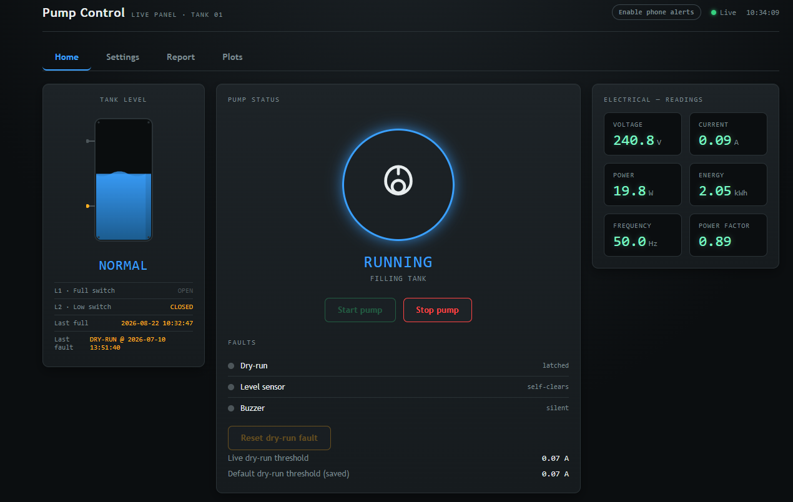
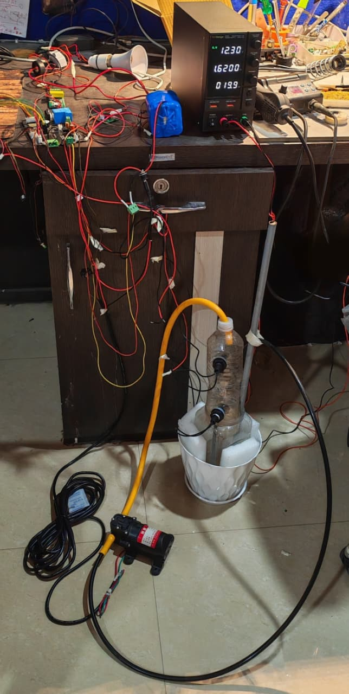
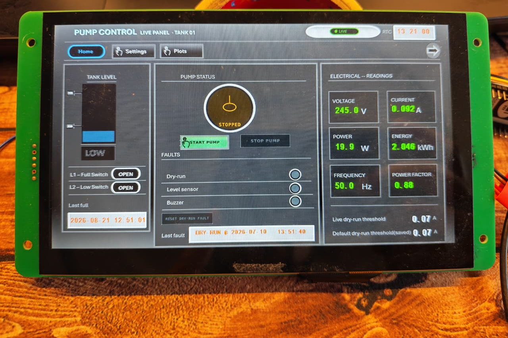

# BHARAT IOT — Automatic Pump Controller

An ESP32-based automatic water pump controller for a single tank, with a built-in
web dashboard, dry-run and level-fault protection, power monitoring, on-device
history logging, and optional remote access from anywhere via a cloud bridge.

The device runs completely standalone on its own WiFi hotspot — no internet or
router required for local use. A small companion cloud service (this repo also
includes it) lets you check on and control the pump from outside your home network.

## Screenshots & Hardware

| Web Dashboard | Hardware | DWIN HMI Panel |
|:---:|:---:|:---:|
|  |  |  |

---

## Table of Contents

- [Overview](#overview)
- [Features](#features)
- [Architecture](#architecture)
- [Repository Structure](#repository-structure)
- [Hardware](#hardware)
- [Getting Started](#getting-started)
  - [1. Firmware (ESP32)](#1-firmware-esp32)
  - [2. Optional: Remote Access via Cloud Bridge](#2-optional-remote-access-via-cloud-bridge)
  - [3. Optional: DWIN HMI Panel](#3-optional-dwin-hmi-panel)
- [Web Dashboard](#web-dashboard)
- [API Reference](#api-reference)
- [Data Logging](#data-logging)
- [Troubleshooting](#troubleshooting)
- [Roadmap](#roadmap)
- [License](#license)

---

## Overview

This project turns an ESP32 into a self-contained smart controller for a single
water pump:

- Automatically starts/stops the pump based on tank level.
- Protects the pump from dry-running using a configurable current threshold
  (via a PZEM004T power sensor).
- Shows live status on an onboard OLED display and NeoPixel indicator.
- Serves a full web dashboard directly from the device — no app, no cloud
  account, no internet needed for local use.
- Logs every pump cycle, fault, and power reading to flash storage (LittleFS)
  so history survives reboots and power loss.
- Can optionally "phone home" to a small cloud relay so you can check on and
  control the pump when you're away from home.

## Features

- **Automatic + manual control** — start/stop the pump automatically, or
  override manually from the dashboard or a physical button.
- **Dry-run protection** — trips a fault if the pump draws less current than
  expected (configurable threshold, with a saved "default" you can restore to).
- **Level-fault protection** — reacts safely to level-sensor issues.
- **Live power monitoring** — voltage, current, power, energy (kWh), frequency,
  and power factor via a PZEM004T sensor.
- **Onboard display** — SSD1306 OLED for at-a-glance status, plus a NeoPixel
  status LED.
- **Real-time clock** — DS3231 RTC (coin-cell backed) timestamps every event,
  even across power loss.
- **Persistent history logs** (LittleFS, survive reboot):
  - `fulllog.csv` — one row per completed pump cycle (start/stop time, runtime,
    energy used, average power factor, and why the cycle ended).
  - `faultlog.csv` — every dry-run / level-sensor / boot-reset fault, tagged to
    the cycle it happened in.
  - `pzemlog.csv` — periodic power-sensor snapshots.
  - Logs auto-trim to the most recent entries so flash usage stays bounded.
- **Built-in web dashboard** — Home / Settings / Report / Plots tabs, served
  directly from the firmware at `http://192.168.4.1/` over the device's own
  WiFi access point.
- **Remote access (optional)** — a lightweight Node.js "cloud bridge" relay
  (deployable to Render or similar) mirrors device status, commands, and logs
  so the same dashboard works from anywhere, without exposing your home
  network.
- **Optional DWIN HMI touch panel** — a physical touchscreen front panel for
  local control without a phone/laptop. *(see [section below](#3-optional-dwin-hmi-panel))*

## Architecture

```
┌─────────────────────────┐        home WiFi         ┌──────────────────────┐
│   ESP32 Pump Controller │ ────────────────────────► │   Cloud Bridge (API) │
│  (AP mode + Station)    │   check-in every ~4s       │   Node.js / Express   │
│                          │ ◄──────────────────────── │   hosted on Render    │
│  Local dashboard at      │      pending commands      │                       │
│  192.168.4.1  (always    │                            │  Mirrors status,      │
│  works, no internet)     │                            │  queues commands,     │
└─────────────────────────┘                            │  mirrors CSV logs     │
             ▲                                          └──────────┬───────────┘
             │ direct WiFi connection                               │ HTTPS
             │ (phone/laptop on the ESP32's AP)                     ▼
             │                                          ┌──────────────────────┐
             └──────────────────────────────────────────│   Remote Dashboard   │
                                                          │  (same UI, served     │
                                                          │  from the bridge)     │
                                                          └──────────────────────┘
```

- **Local mode** always works: connect to the ESP32's own WiFi network and open
  its IP — the pump keeps running and logging even with zero internet access.
- **Remote mode** is additive: the ESP32 also joins your home WiFi and checks in
  with the cloud bridge, which relays status/commands/logs so the same
  dashboard is reachable from outside your home network.

## Repository Structure

```
.
├── BHARAT_IOT_pump_control_curve_9.ino   # Main firmware: pump control, sensors,
│                                          # local web server, dashboard, logging
├── cloud_bridge.ino                       # Companion firmware tab: joins home WiFi,
│                                          # checks in with the cloud bridge, mirrors logs
├── server.js                              # Cloud bridge relay server (Node/Express)
├── public/
│   └── index.html                         # Remote dashboard (ported from the
│                                          # device's own local dashboard)
└── docs/
    └── images/                            # Screenshots & hardware photos (add your own)
```

## Hardware

| Component | Purpose |
|---|---|
| ESP32 dev board | Main controller |
| PZEM004T v3.0 | AC voltage/current/power/energy sensing (dry-run detection) |
| DS3231 RTC + coin cell | Timestamping that survives power loss |
| SSD1306 OLED (I2C) | Onboard status display |
| Adafruit NeoPixel | Status indicator LED |
| Relay / contactor | Pump switching |
| Level sensor(s) | Tank-full / dry detection |
| *(Optional)* DWIN HMI touch panel | Local touchscreen control, no phone needed |

> Add wiring diagrams / schematics here, or link to a `hardware/` folder if you
> have KiCad/Eagle files, BOM, or enclosure photos.

## Getting Started

### 1. Firmware (ESP32)

**Required Arduino libraries** (install via Library Manager):

- `ESP Async WebServer`
- `Async TCP`
- `PZEM004Tv30`
- `Adafruit NeoPixel`
- `Adafruit SSD1306` + `Adafruit GFX`
- `RTClib`

(`LittleFS` ships with the ESP32 Arduino core — no separate install needed.)

**Steps:**

1. Open `BHARAT_IOT_pump_control_curve_9.ino` in the Arduino IDE.
2. If you want remote access, also add `cloud_bridge.ino` as a second tab in the
   same sketch folder (see [below](#2-optional-remote-access-via-cloud-bridge)).
3. Set `AP_SSID` / `AP_PASSWORD` near the top of the main sketch to whatever
   you'd like the device's own WiFi network to be called.
4. Upload the sketch. The dashboard is compiled directly into the firmware —
   there's no separate filesystem/data upload step.
5. Connect your phone or laptop to the ESP32's WiFi network, then open
   `http://192.168.4.1/` in a browser.

### 2. Optional: Remote Access via Cloud Bridge

To reach your pump's dashboard from outside your home network:

1. **Deploy the relay server** (`server.js` + `public/`) somewhere reachable,
   e.g. [Render](https://render.com):
   - Set environment variables `DEVICE_TOKEN` and `DASHBOARD_TOKEN` to your own
     secret values (these gate who can post device data and who can send
     commands, respectively).
2. **Configure the firmware side** — in `cloud_bridge.ino`, set:
   - `HOME_WIFI_SSID` / `HOME_WIFI_PASSWORD` — your home WiFi credentials.
   - `BRIDGE_HOST` — your deployed server's hostname (no `https://`, no
     trailing slash).
   - `BRIDGE_DEVICE_TOKEN` — must match `DEVICE_TOKEN` on the server.
3. Re-upload the firmware. The device will keep serving its local dashboard as
   before, and will also check in with the bridge roughly every few seconds.
4. Open your deployed server's URL to reach the same dashboard from anywhere.

> ⚠️ Treat `DEVICE_TOKEN`, `DASHBOARD_TOKEN`, and your WiFi password as
> secrets — don't commit real values to source control.

### 3. Optional: DWIN HMI Panel

*(Fill in with your specific DWIN model, wiring, and firmware/project files.)*

A DWIN touchscreen panel can be wired to the ESP32 (typically over UART) to
give a local, always-on physical control panel — useful for control near the
pump itself without needing a phone or laptop nearby.

- **Model:** _add your DWIN model number here_
- **Connection:** _e.g. UART TX/RX pins used_
- **DWIN project file:** _link/path if included in this repo_
- **What it shows/controls:** _e.g. pump status, start/stop, threshold_

## Web Dashboard

The dashboard (served locally by the firmware, and mirrored remotely by the
cloud bridge) includes:

- **Home** — live pump/level/fault status, manual start/stop, current readings.
- **Settings** — dry-run threshold (live + saved default), RTC time sync,
  phone-alerts toggle.
- **Report** — downloadable/clearable history logs (`fulllog.csv`,
  `faultlog.csv`, `pzemlog.csv`).
- **Plots** — visualizations built from the logged data.

## API Reference

Exposed by the firmware locally (`http://192.168.4.1/…`) and mirrored by the
cloud bridge:

| Method | Endpoint | Description |
|---|---|---|
| `GET`  | `/status` | JSON snapshot of pump/level/fault/electrical state |
| `POST` | `/api/start` | Request pump start (same rules as the physical button) |
| `POST` | `/api/stop` | Request pump stop (always allowed — safety stop) |
| `POST` | `/api/reset` | Clear a latched dry-run fault |
| `POST` | `/api/setThreshold?value=A` | Set the *live* dry-run current threshold |
| `POST` | `/api/setThresholdDefault?value=A` | Set the *saved default* threshold |
| `POST` | `/api/applyThresholdDefault` | Restore live threshold from saved default |
| `POST` | `/api/setTime?epoch=N` | Set the DS3231 RTC to Unix time `N` |
| `POST` | `/api/clearLog?log=full\|fault\|pzem\|all` | Wipe a history log to just its header row |
| `GET`  | `/fulllog.csv` | Download full pump-cycle log |
| `GET`  | `/faultlog.csv` | Download fault log |
| `GET`  | `/pzemlog.csv` | Download power-sensor log |

Cloud-bridge-only endpoints (used internally by the device, not typically
called directly): `POST /api/device/checkin`, `POST /api/device/logs`,
`GET /api/status`, `GET /healthz`.

## Data Logging

All logs are stored on the ESP32's onboard flash (LittleFS), so they survive
reboots and power loss:

- `fulllog.csv` — cycle number, start time, stop time, runtime (s), energy
  used (kWh), average power factor, and stop reason
  (`TANK-FULL` / `MANUAL` / `DRY-FAULT` / `LEVEL-FAULT`).
- `faultlog.csv` — every fault event, tagged with the cycle it occurred during.
- `pzemlog.csv` — periodic power-sensor snapshots (roughly once a minute).

Each log auto-trims to its most recent entries, so flash usage stays bounded
without any manual maintenance — the "Clear log" buttons in the dashboard are
only needed if you want to wipe a log sooner than that.

## Troubleshooting

- **"Sketch too big" / flash overflow when compiling** — switch
  `Tools → Partition Scheme` to a no-OTA scheme with a larger app partition
  (e.g. *Minimal SPIFFS* or *No OTA*), since this firmware doesn't use OTA
  updates and only needs a small filesystem for logs/settings.
- **No internet on your phone while connected to the pump's WiFi** — expected;
  the ESP32's own hotspot has no internet uplink. This doesn't affect the
  dashboard.
- **Cloud dashboard shows "device offline"** — check that `BRIDGE_HOST` and
  `BRIDGE_DEVICE_TOKEN` in `cloud_bridge.ino` match your deployed server, and
  that the ESP32 successfully joined `HOME_WIFI_SSID`.

## Roadmap

- [ ] Add hardware schematics / BOM
- [ ] Add DWIN panel project files and wiring diagram
- [ ] Multi-tank support
- [ ] Push notifications for faults

## License

This project is licensed under the [MIT License](LICENSE).

Copyright © 2026 [Bharat IoT](https://www.bharatiot.in/)

Permission is hereby granted, free of charge, to any person obtaining a copy
of this software and associated documentation files (the "Software"), to deal
in the Software without restriction, including without limitation the rights
to use, copy, modify, merge, publish, distribute, sublicense, and/or sell
copies of the Software, subject to the inclusion of the above copyright
notice in all copies or substantial portions of the Software. See the
[LICENSE](LICENSE) file for the full text.
